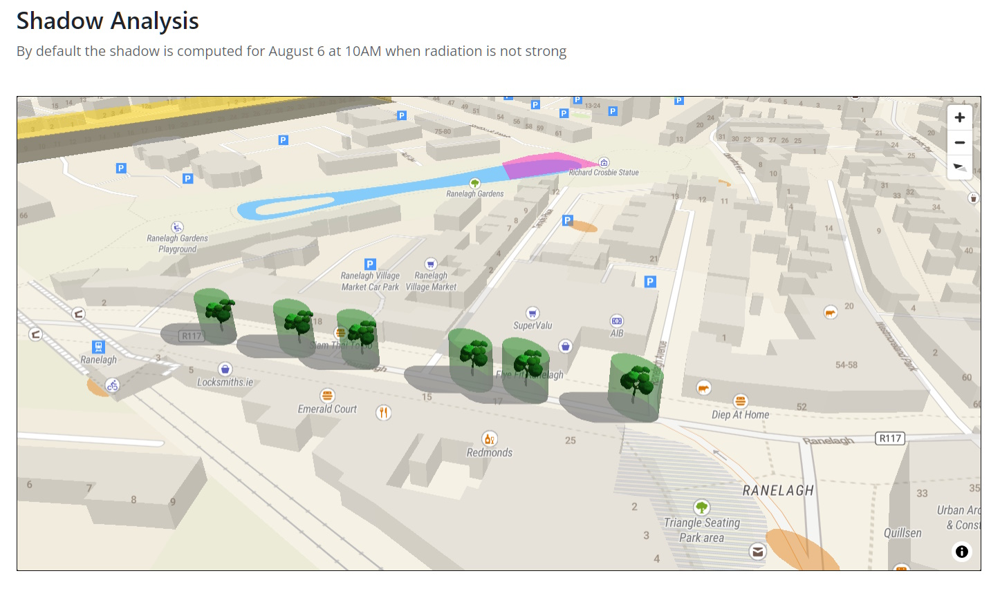
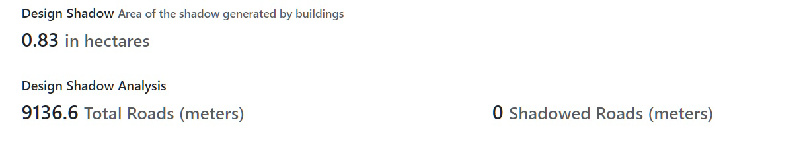

# Local Climate Indicators
This plugin uses the [Geodesignhub API](https://www.geodesignhub.com/api) to download information about a design and / or diagrams to  analyze it to produce a variety of views around heat and flood impacts at a local level. 

### Adding your project
This plugin can be added to your project in the Administration interface or at the time of Geodesignhub project creation. 

### Details
This plugin provides analytical capability for any diagram and design from Geodesignhub as a one-click integration, we use the API to download all the data. 

### Motivation
The overall objective of this project is to develop a set of tools to focus on heat and flood response at a local scale. This dashboard will be flexible and will be used as a plugin to Geodesignhub and will analyze data provided by Geodesignhub. In addition, it will connect to external data platforms to download layers and data. 

In addition to the metrics, a summary page would be generated for a design that presents a summary analysis of the metrics developed. 

We focus on heat / shadow response first and then to flooding mitigation response.

### Screenshots
Shadows and trees

Analysis of generated shadows
