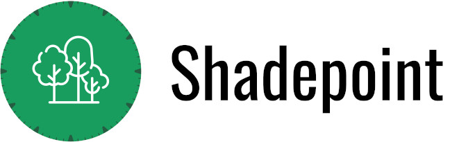
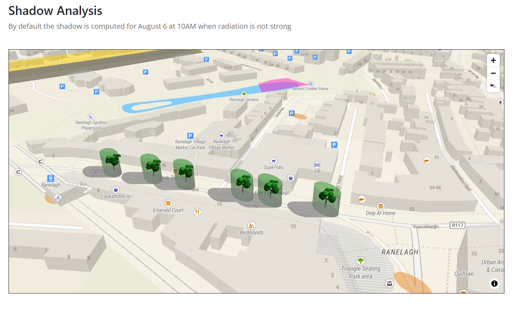
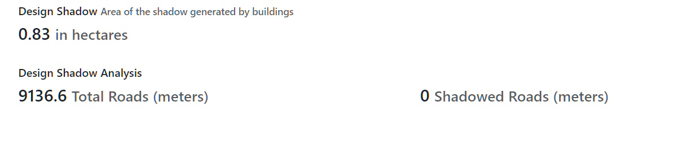

# Shadepoint
This plugin uses the [Geodesignhub API](https://www.geodesignhub.com/api) to download information about a design and / or diagrams to  analyze it to produce a variety of views around heat and shade impacts at a local level. 

### Adding your project
This plugin can be added to your project in the Administration interface or at the time of Geodesignhub project creation. 

### Details
This plugin provides analytical capability for any diagram and design from Geodesignhub as a one-click integration, we use the API to download all the data. 

## Setup

### Prerequisites

- Python 3.12+
- [uv](https://docs.astral.sh/uv/) — install via `curl -LsSf https://astral.sh/uv/install.sh | sh`
- PostgreSQL with PostGIS extension
- Redis

### Install dependencies

```bash
uv sync
```

### Environment variables

Copy the sample env file and fill in your values:

```bash
cp .env.sample.txt .env
```

Key variables:

| Variable | Description |
|---|---|
| `DB_ENGINE` | Database engine (e.g. `postgresql`) |
| `DB_USERNAME` | Database user |
| `DB_PASSWORD` | Database password |
| `DB_NAME` | Database name |
| `DB_HOSTNAME` | Database host |
| `DB_PORT` | Database port (default `5432`) |
| `REDIS_URL` | Redis connection URL |
| `maptiler_key` | MapTiler API key |

## Initial Database setup

Create an initial database.

Log in to the database as user `postgres`, from command line:

```bash
psql -U postgres
```

Then create the new database via commands below.

```sql
CREATE DATABASE localclimateresponse;
ALTER DATABASE localclimateresponse SET search_path=public,postgis,contrib;
\connect localclimateresponse;
CREATE SCHEMA postgis;
CREATE EXTENSION postgis SCHEMA postgis;
CREATE USER localclimateresponse;
ALTER ROLE localclimateresponse WITH PASSWORD 'localclimateresponse';
GRANT all privileges ON DATABASE localclimateresponse TO localclimateresponse;
ALTER DATABASE localclimateresponse OWNER TO localclimateresponse;
```

### Run migrations and update database

```bash
uv run flask --app app db upgrade
```

### Seed the database

```bash
uv run flask --app app seed-db
```

### Start the app

```bash
uv run flask --app app run
```

### Start the background worker

```bash
uv run python worker.py
```


### Motivation
The overall objective of this project is to develop a set of tools to focus on heat response at a local scale. This dashboard will be flexible and will be used as a plugin to Geodesignhub and will analyze data provided by Geodesignhub. In addition, it will connect to external data platforms to download layers and data. 

In addition to the metrics, a summary page would be generated for a design that presents a summary analysis of the metrics developed. 

### Shadow Analysis / Heat Response
We focus on heat / shadow and management response.

### Screenshots
Shadows and trees


Analysis of generated shadows


## 3/30/300 Rule

Shadepoint implements the [3/30/300 urban greening standard](https://nbsi.eu/330300-principle/) across two views.

### What is the 3/30/300 rule?

| Rule | Target | Description |
|---|---|---|
| **Rule 3** | See 3 trees | Every resident should be able to see at least 3 trees from home or work |
| **Rule 30** | 30% canopy cover | 30% of a neighbourhood should be covered by tree canopy |
| **Rule 300** | Within 300 m | Every resident should live within 300 m of a green space ≥ 1 ha |

### Draw Trees view (`/draw_trees/`)

A **live compliance dashboard** appears below the map as soon as the first tree is drawn. It updates on every add, move, or delete:

- **Rule 3** — average number of trees visible within 50 m of each drawing point (uses building centroids if the `Buildings` layer is present, otherwise falls back to tree-to-tree proximity)
- **Rule 30** — canopy percentage over the project bounding box; draws on drawn-tree canopy (default 5 m diameter) plus any pre-existing canopy from the `Existing Canopy` layer
- **Rule 300** — worst-case distance from any drawn tree to the nearest green space centroid from the `Green Spaces` layer

A **Data Layers** status panel shows which named FGB layers were detected and which rules are active or unavailable.

### Design Shadow view (`/design_shadow/`)

A **300 m green-space reach heatmap** renders semi-transparent green halos around every tree in the design. Areas inside a halo are within 300 m of a planned tree. The same Data Layers panel lists which FGB layers are present.

### Required FGB analytical layers

The computations depend on specific FGB layer names configured in the project. Names are matched **case-insensitively**.

| FGB Layer Name | Used for | Required? |
|---|---|---|
| `Existing Canopy` | Rule 30 — adds pre-existing canopy area to coverage total | Optional |
| `Green Spaces` | Rule 300 — source of green space polygon centroids | Required for Rule 300 |
| `Buildings` | Rule 3 — building footprints for window-visibility check | Required for Rule 3 |

If a required layer is absent the corresponding rule shows **"Layer unavailable"** rather than failing silently. Click the **ⓘ** icon next to the Data Layers heading on either page for a quick-reference table of the expected names.

## Compatible with NBSAPI


This application is fully compatible with NBSAPI, allowing seamless integration and data exchange. For more information, please visit the [NBSAPI website](https://nbsapi.org).
